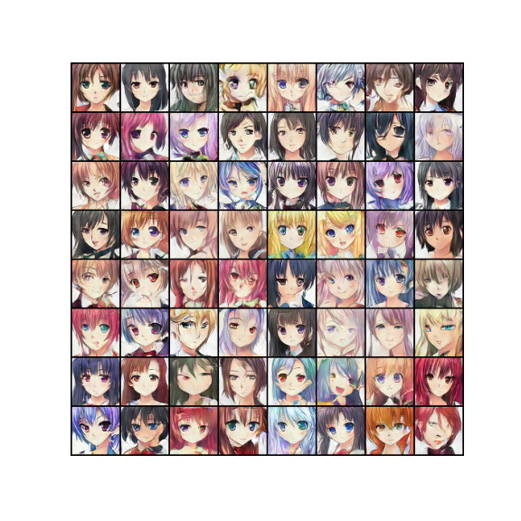

# DCGAN Anime faces

This repository contains a Deep Convolutional Generative Adversarial Network (DCGAN) for generating anime faces. The model is trained on the [Anime Face Dataset](https://www.kaggle.com/datasets/splcher/animefacedataset).

Here is a sample anime faces generated by the model after 100 epochs.

## References

- [Generative Adversarial Nets](https://proceedings.neurips.cc/paper_files/paper/2014/file/5ca3e9b122f61f8f06494c97b1afccf3-Paper.pdf)
- [UNSUPERVISED REPRESENTATION LEARNING WITH DEEP CONVOLUTIONAL GENERATIVE ADVERSARIAL NETWORKS](https://arxiv.org/pdf/1511.06434.pdf)
- [PyTorch DCGAN tutorial](https://pytorch.org/tutorials/beginner/dcgan_faces_tutorial.html)